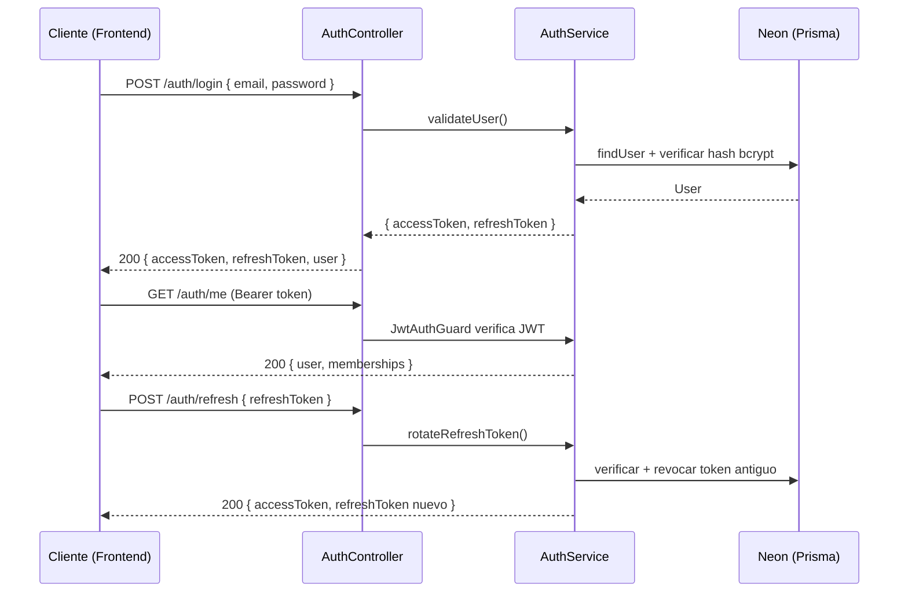
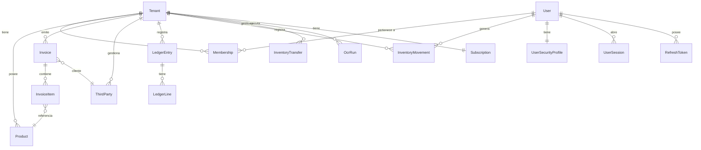

# Contex360 — Backend API

> ERP colombiano certificado DIAN. Backend construido con **NestJS + Prisma + PostgreSQL (Neon)**.

---

## Stack tecnológico

| Capa | Tecnología |
|---|---|
| Framework | NestJS 10 |
| ORM | Prisma 5 |
| Base de datos | PostgreSQL via Neon (pooler PgBouncer) |
| Autenticación | JWT (access token) + Refresh Token |
| Validación | class-validator + ValidationPipe |
| Documentación | Swagger / OpenAPI en `/docs` |
| Rate limiting | @nestjs/throttler |
| Scheduler | @nestjs/schedule |
| Runtime | Node.js 20 / TypeScript 5 |

---

## Instalación rápida

```powershell
# 1. Instalar dependencias
npm install

# 2. Configurar variables de entorno
copy .env.example .env
# Editar .env con las credenciales de Neon

# 3. Generar cliente Prisma
npx prisma generate

# 4. Aplicar migraciones
npx prisma migrate deploy

# 5. Iniciar en desarrollo
npm run start:dev
```

El servidor queda disponible en `http://localhost:3001`.  
Swagger en `http://localhost:3001/docs`.

---

## Variables de entorno requeridas

```env
# Base de datos (Neon)
DATABASE_URL=postgresql://...?sslmode=require&pgbouncer=true
DIRECT_URL=postgresql://...?sslmode=require

# JWT
JWT_SECRET=<secreto_largo_aleatorio>
JWT_EXPIRES_IN=15m
JWT_REFRESH_SECRET=<secreto_refresh>
JWT_REFRESH_EXPIRES_IN=7d

# Servidor
PORT=3001
APP_NAME=Contex360 Backend
CORS_ORIGIN=http://localhost:5173

# Swagger
SWAGGER_PATH=docs
```

---

## Arquitectura de módulos

```
src/
├── app.module.ts          # Módulo raíz
├── main.ts                # Bootstrap: CORS, Swagger, pipes, interceptors
├── common/
│   ├── interceptors/      # LoggingInterceptor
│   └── env-validator.ts   # Validación de variables de entorno al arranque
└── modules/
    ├── auth/              # Autenticación JWT + sesiones + 2FA + RBAC
    ├── database/          # PrismaModule (singleton global)
    ├── health/            # Health check
    ├── products/          # Gestión de productos e inventario base
    ├── third-parties/     # Clientes y proveedores
    ├── invoices/          # Facturación electrónica DIAN
    ├── inventory/         # Movimientos y traslados de inventario
    ├── analytics/         # KPIs y métricas de negocio
    ├── ai/                # OCR e inteligencia artificial
    ├── admin/             # Consola de administración global
    ├── notification/      # Sistema de notificaciones
    └── demo/              # Gestión de solicitudes de demo
```

### Patrón por módulo

```
Route (Controller) → Guard (JWT/RBAC) → Service → PrismaService → Neon DB
```

---

## Flujo de autenticación



---

## Endpoints principales

### Auth — `/auth`

| Método | Ruta | Auth | Descripción |
|---|---|---|---|
| POST | `/auth/login` | ❌ | Login con email + password |
| GET | `/auth/me` | JWT | Usuario autenticado + memberships |
| POST | `/auth/refresh` | ❌ | Rotar refresh token |
| POST | `/auth/logout` | JWT | Revocar sesión |
| GET | `/auth/sessions` | JWT | Sesiones activas del usuario |

### Productos — `/products`

| Método | Ruta | Auth | Descripción |
|---|---|---|---|
| GET | `/products` | JWT | Listar productos del tenant |
| POST | `/products` | JWT | Crear producto |
| PATCH | `/products/:id` | JWT | Actualizar producto |
| DELETE | `/products/:id` | JWT | Eliminar producto |

### Terceros — `/third-parties`

| Método | Ruta | Auth | Descripción |
|---|---|---|---|
| GET | `/third-parties` | JWT | Listar clientes/proveedores |
| POST | `/third-parties` | JWT | Crear tercero |
| PATCH | `/third-parties/:id` | JWT | Actualizar tercero |
| DELETE | `/third-parties/:id` | JWT | Eliminar tercero |

### Facturas — `/invoices`

| Método | Ruta | Auth | Descripción |
|---|---|---|---|
| GET | `/invoices` | JWT | Listar facturas del tenant |
| POST | `/invoices` | JWT | Crear factura |
| PATCH | `/invoices/:id` | JWT | Actualizar estado |
| DELETE | `/invoices/:id` | JWT | Eliminar factura draft |

### Inventario — `/inventory`

| Método | Ruta | Auth | Descripción |
|---|---|---|---|
| GET | `/inventory/movements` | JWT | Historial de movimientos |
| POST | `/inventory/movements` | JWT | Registrar entrada/salida |
| GET | `/inventory/transfers` | JWT | Traslados entre bodegas |
| POST | `/inventory/transfers` | JWT | Crear traslado |

### Analytics — `/analytics`

| Método | Ruta | Auth | Descripción |
|---|---|---|---|
| GET | `/analytics/revenue` | JWT | Ingresos por período |
| GET | `/analytics/kpis` | JWT | KPIs del dashboard |

### Health — `/health`

| Método | Ruta | Auth | Descripción |
|---|---|---|---|
| GET | `/health` | ❌ | Estado del servidor y DB |

---

## Modelos de base de datos

### Diagrama de relaciones



### Descripción de modelos

#### `User`
Usuario del sistema. Puede ser `isSystemOwner` (acceso global) o usuario normal con memberships por tenant.

| Campo | Tipo | Descripción |
|---|---|---|
| `id` | cuid | Identificador único |
| `email` | String (unique) | Email de acceso |
| `isSystemOwner` | Boolean | Acceso total al sistema |
| `status` | `active / inactive / pending` | Estado del usuario |
| `passwordHash` | String? | Hash bcrypt de la contraseña |

#### `Tenant`
Empresa/organización dentro del sistema (multi-tenant).

| Campo | Tipo | Descripción |
|---|---|---|
| `nit` | String? | NIT de la empresa |
| `dianStatus` | String? | Estado de habilitación DIAN |
| `allowNegativeStock` | Boolean | Permitir stock negativo |
| `securitySettings` | Json | Configuración de seguridad por tenant |

#### `Membership`
Relación Usuario ↔ Tenant con rol asignado (`owner`, `Administrador`, `Contador`, `Visor`, etc.).

#### `Product`
Producto del catálogo. Soporta ubicaciones múltiples (`stockByLocation: Json`), kits (`kitComponents`), tipos y unidades.

#### `Invoice` / `InvoiceItem`
Factura electrónica con estados DIAN: `draft → emitted → sent → accepted / cancelled`. Cada item referencia un producto del catálogo.

#### `LedgerEntry` / `LedgerLine`
Asiento contable doble entrada. Cada `LedgerEntry` agrupa múltiples `LedgerLine` con cuentas débito/crédito.

#### `InventoryMovement`
Registro de cada entrada o salida de stock, con lote, fecha de vencimiento y referencia al documento origen.

#### `InventoryTransfer`
Traslado de mercancía entre bodegas (`fromLocId → toLocId`) con estados: `pendiente → en_transito → completado / cancelado`.

#### `UserSecurityProfile`
Configuración de seguridad por usuario: 2FA (TOTP), bloqueo por intentos fallidos, historial de contraseñas, fingerprints confiables.

#### `AuditEvent`
Log inmutable de acciones críticas: entidad, acción, actor, severidad (`info / warning / error / critical`).

#### `OcrRun`
Resultado de procesamiento OCR con campos extraídos (`fields: Json`) y nivel de confianza.

#### `DemoRequest`
Solicitudes de demo desde la landing page con flujo de estados: `nuevo → contactado → demo_agendada → convertido`.

---

## Comandos Prisma (PowerShell)

```powershell
# Generar cliente tras cambios de schema
npx prisma generate

# Crear nueva migración
npx prisma migrate dev --name nombre_migracion

# Aplicar migraciones en producción
npx prisma migrate deploy

# Ver datos en interfaz visual
npx prisma studio

# Resetear base de datos (¡destructivo!)
npx prisma migrate reset
```

---

## Usuario de prueba

```
Email:    admin@contex360.com
Password: Admin123!
Tenant:   Empresa Demo (tenant-001)
Rol:      owner
```

---

## Seguridad

- Todas las rutas protegidas requieren `Authorization: Bearer <accessToken>`
- El tenant activo se pasa en header `x-tenant-id`
- Rate limiting: 100 req/min (short) y 1000 req/hora (long) por IP
- RBAC implementado en guards — verificar rol antes de operaciones críticas
- Contraseñas hasheadas con bcrypt (salt rounds: 12)
- Refresh tokens rotados en cada uso y almacenados como hash SHA-256

---

## Swagger

Disponible en desarrollo en `http://localhost:3001/docs`.  
Soporta autenticación Bearer para probar endpoints protegidos.

---

*Última actualización: Mayo 2026 — Contex360 v0.1.0*
